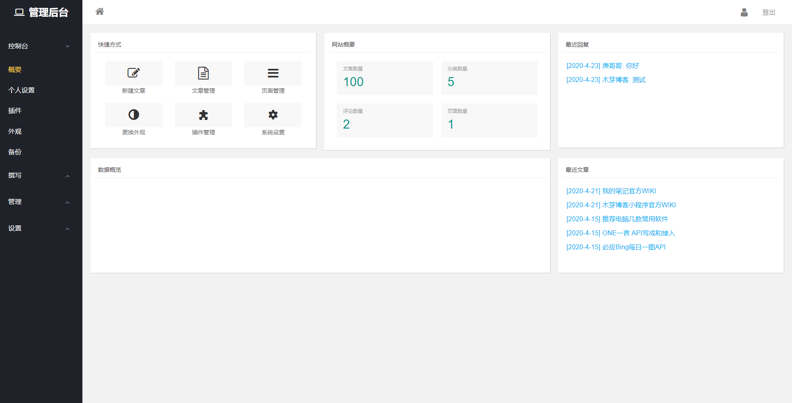

# 魔改typecho


添加自己喜欢的样式和功能，下面会把var核心文件的每一处修改标注，admin文件的修改基本是样式问题，就不具体描述。





### 修改一

根据样式问题删掉部分<br>

>  var/Widget/Users/Profile.php的个人资料删掉<br>


### 修改二 （添加置顶文章）

1、在var/Widget/Contents/Post文件夹的Recent.php

源代码：

```php
$this->db->fetchAll($this->select()
        ->where('table.contents.status = ?', 'publish')
        ->where('table.contents.created < ?', $this->options->time)
        ->where('table.contents.type = ?', 'post')
        ->order('table.contents.created', Typecho_Db::SORT_DESC)
        ->limit($this->parameter->pageSize), array($this, 'push'));
```

修改后

```php
$this->db->fetchAll($this->select()
    ->where('table.contents.status = ?', 'publish')
    ->where('table.contents.created < ?', $this->options->time)
    ->where('table.contents.type = ?', 'post')
    ->order('table.contents.order', Typecho_Db::SORT_DESC)
    ->order('table.contents.created', Typecho_Db::SORT_DESC)
    ->limit($this->parameter->pageSize), array($this, 'push'));
```

2、在var/Widget/Contents/Post文件夹的Edit.php，发布文章函数writePost(),添加oder

```php
 $contents = $this->request->from('password', 'allowComment',
            'allowPing', 'allowFeed', 'slug', 'tags', 'text', 'order', 'visibility');
```

3、在var/Widget/Archive.php的execute()函数末尾修改为

```php
 $select->order('table.contents.order', Typecho_Db::SORT_DESC, 'table.contents.created', Typecho_Db::SORT_DESC)
            ->page($this->_currentPage, $this->parameter->pageSize);
```

4、typecho的默认数据库函数不支持两个order by查询，所以我们修改它，找到var/Typecho/Db/Query.php,修改order函数

```php
    public function order($orderby, $sort = Typecho_Db::SORT_ASC)
    {
        if (func_num_args() > 2) {
            $this->_sqlPreBuild['order'] = ' ORDER BY ' . $this->filterColumn($orderby) . (empty($sort) ? null : ' ' . $sort) . ',' . $this->filterColumn(func_get_arg(2)) . (empty(func_get_arg(3)) ? null : ' ' . $sort);
        } else {
            $this->_sqlPreBuild['order'] = ' ORDER BY ' . $this->filterColumn($orderby) . (empty($sort) ? null : ' ' . $sort);
        }

        return $this;
    }
```
5、界面设置置顶，在admin/write-post.php在标签后面添加即可

```html
<section class="typecho-post-option">
    <label for="order" class="typecho-label"><?php _e('置顶');?></label>
    <p>
        <select id="order" name="order" class="w-100">
            <option value="0" <?php if ($post->order == '0' || !$post->order): ?>
                selected<?php endif;?>><?php _e('否');?></option>
            <option value="1" <?php if ($post->order == '1'): ?> selected<?php endif;?>>
                <?php _e('是');?></option>
        </select>
    </p>
</section>
```


### 修改三 （浏览量）

1、在var/Widget/Abstract/Contents.php 的select()函数添加'table.contents.views'字段

```php
public function select()
    {
        return $this->db->select('table.contents.cid', 'table.contents.title', 'table.contents.slug', 'table.contents.created', 'table.contents.views', 'table.contents.authorId',
            'table.contents.modified', 'table.contents.type', 'table.contents.status', 'table.contents.text', 'table.contents.commentsNum', 'table.contents.order',
            'table.contents.template', 'table.contents.password', 'table.contents.allowComment', 'table.contents.allowPing', 'table.contents.allowFeed',
            'table.contents.parent')->from('table.contents');

    }
```

2、在var/Widget/Archive.php的singleHandle 添加浏览加1；

```php
 //浏览+1
        if ('post' == $this->parameter->type) {
            if (isset($this->request->cid)) {
                $cid = $this->request->cid;
                $views = Typecho_Cookie::get('extend_contents_views');
                if (empty($views)) {
                    $views = array();
                } else {
                    $views = explode(',', $views);
                }
                if (!in_array($cid, $views)) {
                    $row = $this->db->fetchRow($this->db->select('views')->from('table.contents')->where('cid = ?', $cid));
                    $this->db->query($this->db->update('table.contents')->rows(array('views' => (int) $row['views'] + 1))->where('cid = ?', $cid));
                    array_push($views, $cid);
                    $views = implode(',', $views);
                    Typecho_Cookie::set('extend_contents_views', $views);
                }
            }
        }
```
3、使用方法，跟其他变量一样使用

```php
$this->views()
```